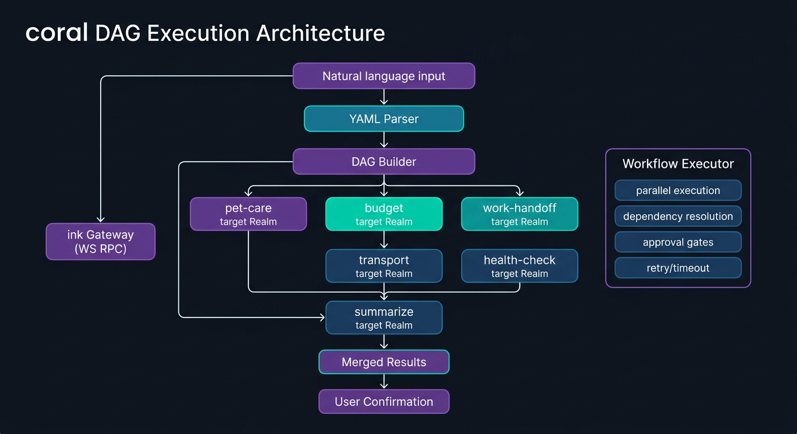
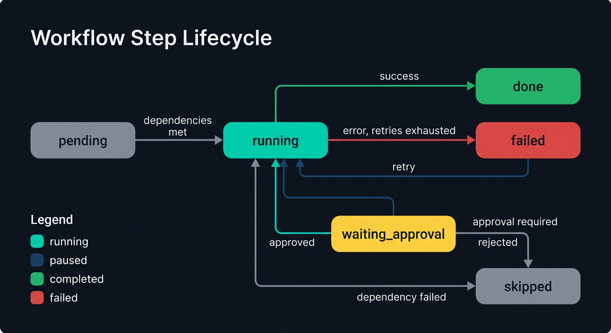

<p align="center">
  <picture>
    <source media="(prefers-color-scheme: light)" srcset="https://raw.githubusercontent.com/open-octopus/openoctopus.club/main/src/assets/brand/logo-dark.png">
    
  </picture>
</p>

<h3 align="center">coral</h3>

<p align="center">
  Cross-realm workflow engine — orchestrate multi-domain automation pipelines.
</p>

<p align="center">
  <a href="https://github.com/open-octopus/coral/blob/main/LICENSE"></a>
  <a href="#"></a>
  <a href="https://github.com/open-octopus/openoctopus"></a>
  <a href="https://discord.gg/openoctopus"></a>
</p>

---

> **Status: Planned** — Part of the OpenOctopus ecosystem roadmap.
> Star this repo to follow progress.

## What is coral?

**coral** is the cross-realm workflow engine for [OpenOctopus](https://github.com/open-octopus/openoctopus). While each Realm operates autonomously, real life often requires coordination across domains. coral provides DAG-based (Directed Acyclic Graph) orchestration for multi-realm automation pipelines.

Named after the coral structures that connect and support diverse life in a reef, coral connects your Realms into coordinated workflows.

## Example: Travel Preparation

When you say *"I'm traveling to Tokyo next week for 5 days"*, coral orchestrates across multiple Realms:

```
┌─────────────────────────────────────────────────────┐
│              Trigger: "Travel to Tokyo, 5 days"      │
└──────────────────────┬──────────────────────────────┘
                       │
          ┌────────────┼────────────┐
          ▼            ▼            ▼
   ┌────────────┐ ┌─────────┐ ┌──────────┐
   │ Pet Realm  │ │ Finance │ │ Work     │
   │            │ │ Realm   │ │ Realm    │
   │ Momo:      │ │         │ │          │
   │ "Who feeds │ │ Budget  │ │ Set OOO  │
   │  me for    │ │ estimate│ │ Delegate │
   │  5 days?"  │ │ ¥X,XXX  │ │ tasks    │
   └─────┬──────┘ └────┬────┘ └────┬─────┘
         │              │           │
         ▼              ▼           ▼
   ┌────────────┐ ┌─────────┐ ┌──────────┐
   │ Parents    │ │ Vehicle │ │ Health   │
   │ Realm      │ │ Realm   │ │ Realm    │
   │            │ │         │ │          │
   │ Mom: "I can│ │ Airport │ │ Travel   │
   │ come take  │ │ parking │ │ insurance│
   │ care of    │ │ or taxi?│ │ check    │
   │ Momo!"     │ │         │ │          │
   └────────────┘ └─────────┘ └──────────┘
         │              │           │
         └──────────────┼───────────┘
                        ▼
              ┌──────────────────┐
              │ Travel Checklist  │
              │ (unified action   │
              │  plan for user    │
              │  confirmation)    │
              └──────────────────┘
```

Each Realm's agents contribute their perspective, and coral merges the results into a unified, actionable plan.

<p align="center">
  
</p>

## Planned Design

### DAG Orchestration

Workflows are defined as directed acyclic graphs where each node is a Realm query or action:

```yaml
workflow: travel-preparation
trigger: "travel to {destination} for {duration}"
steps:
  - id: pet-care
    realm: pet
    action: arrange-care
    params: { duration: "{{duration}}" }

  - id: budget
    realm: finance
    action: estimate-budget
    params: { destination: "{{destination}}", duration: "{{duration}}" }

  - id: work-handoff
    realm: work
    action: set-out-of-office
    params: { duration: "{{duration}}" }

  - id: transport
    realm: vehicle
    action: plan-transport
    depends_on: [budget]

  - id: health-check
    realm: health
    action: travel-health-check
    params: { destination: "{{destination}}" }

  - id: summarize
    action: merge-results
    depends_on: [pet-care, budget, work-handoff, transport, health-check]
```

### Core Capabilities

- **DAG execution** — Parallel and sequential step orchestration with dependency resolution
- **Cross-realm context** — Each step can read (but not write) data from other Realms
- **Summoned agent participation** — Summoned entities contribute to workflows from their perspective
- **Human-in-the-loop** — Critical actions require user confirmation before execution
- **Failure handling** — Retry, skip, or fallback strategies per step
- **Resumable** — Pause at approval gates, resume later without re-running completed steps

<p align="center">
  
</p>

## Planned CLI

```bash
# Run a workflow by name
coral run travel-preparation --args '{"destination":"Tokyo","duration":"5 days"}'

# Run from a YAML file
coral run --file workflows/travel-preparation.yml --args '{"destination":"Tokyo","duration":"5 days"}'

# Dry run — show what would execute without side effects
coral run travel-preparation --dry-run --args '{"destination":"Tokyo","duration":"5 days"}'

# List available workflows
coral list

# Validate a workflow file
coral validate workflows/my-workflow.yml

# Resume a paused workflow (at approval gate)
coral resume --token wf_abc123
```

### Expected Output

```
$ coral run travel-preparation --args '{"destination":"Tokyo","duration":"5 days"}'

[coral] Starting workflow: travel-preparation
[coral] Step pet-care     ... running (Pet Realm)
[coral] Step budget       ... running (Finance Realm)
[coral] Step work-handoff ... running (Work Realm)
[coral] Step health-check ... running (Health Realm)
[coral] Step pet-care     ... done — Mom will care for Momo
[coral] Step budget       ... done — Estimated budget: ¥180,000
[coral] Step work-handoff ... done — OOO set, tasks delegated
[coral] Step health-check ... done — Travel insurance valid
[coral] Step transport    ... running (Vehicle Realm, depends on: budget)
[coral] Step transport    ... done — Airport taxi booked, ¥6,500
[coral] Step summarize    ... merging results

Travel Checklist:
  - Pet care: Mom will visit daily (confirmed)
  - Budget: ¥180,000 estimated (flights ¥85,000 + hotel ¥65,000 + daily ¥30,000)
  - Work: OOO Mar 15-20, 3 tasks delegated to team
  - Transport: Taxi to NRT, ¥6,500 (pickup 6:00 AM)
  - Health: Travel insurance active, no vaccinations needed

Approve this plan? [y/n]
```

## More Workflow Examples

### Morning Routine

```yaml
workflow: morning-routine
trigger: "good morning"
steps:
  - id: health-check
    realm: health
    action: daily-summary

  - id: calendar
    realm: work
    action: today-preview

  - id: pet-status
    realm: pet
    action: care-status

  - id: weather
    action: fetch-weather

  - id: summarize
    action: merge-results
    depends_on: [health-check, calendar, pet-status, weather]
```

### Moving House

```yaml
workflow: moving-house
trigger: "moving to {address} on {date}"
steps:
  - id: utilities
    realm: home
    action: transfer-utilities
    params: { new_address: "{{address}}", date: "{{date}}" }

  - id: pet-logistics
    realm: pet
    action: moving-plan
    params: { date: "{{date}}" }

  - id: address-update
    realm: legal
    action: update-address
    params: { new_address: "{{address}}" }

  - id: insurance
    realm: finance
    action: update-policies
    depends_on: [address-update]

  - id: vet-transfer
    realm: pet
    action: find-new-vet
    depends_on: [pet-logistics]
    params: { near: "{{address}}" }
    approval: required

  - id: checklist
    action: merge-results
    depends_on: [utilities, pet-logistics, address-update, insurance, vet-transfer]
```

## Planned Tech Stack

| Component | Choice |
|-----------|--------|
| Runtime | Node.js >= 22 + TypeScript |
| DAG Engine | Custom (inspired by LangGraph, Temporal) |
| Workflow Format | YAML definitions |
| Integration | WebSocket RPC to ink gateway |

## Roadmap

- [ ] Workflow YAML format specification
- [ ] DAG parser and validator
- [ ] Step executor with dependency resolution
- [ ] Cross-realm context injection
- [ ] Summoned agent participation protocol
- [ ] Built-in workflow templates (travel, moving, event planning)
- [ ] Visual workflow editor (dashboard integration)

## Related Projects

| Project | Description |
|---------|-------------|
| [openoctopus](https://github.com/open-octopus/openoctopus) | Core monorepo — Realm manager, agent runner, ink gateway |
| [realms](https://github.com/open-octopus/realms) | Official realm packages |
| [realmhub](https://github.com/open-octopus/realmhub) | Realm package marketplace |

## Contributing

coral is in the planning phase. Join [The Reef (Discord)](https://discord.gg/openoctopus) to discuss workflow design, or open an issue with use case ideas.

See [CONTRIBUTING.md](https://github.com/open-octopus/.github/blob/main/CONTRIBUTING.md) for general guidelines.

## License

[MIT](LICENSE) — see the [.github repo](https://github.com/open-octopus/.github) for the full license text.
